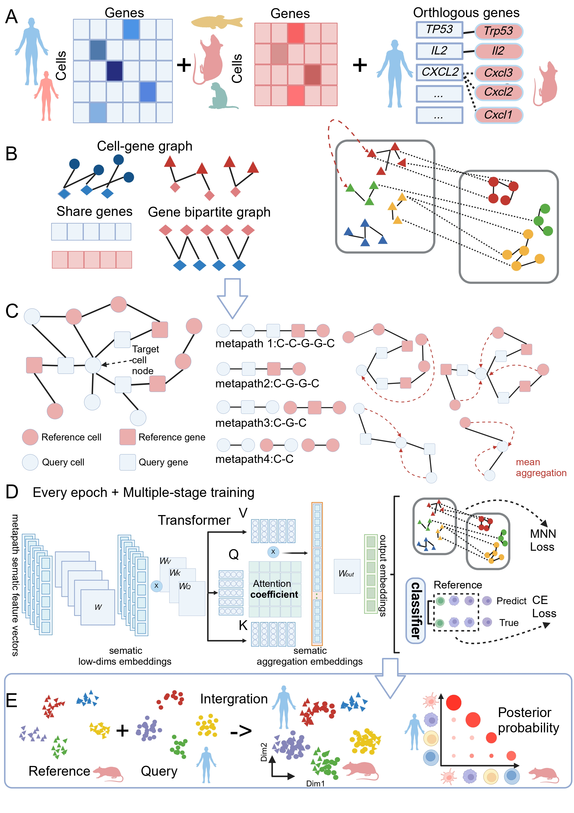

# TACMAN

## Overview



## Create runtime environment

```bash
# create environment
conda create --name TACMAN --file require_TACMAN_conda --yes
conda activate TACMAN
pip install torch==2.0.1 torchvision==0.15.2 torchaudio==2.0.2 --index-url https://download.pytorch.org/whl/cpu
conda activate

# create python kernel
conda activate TACMAN
python -m ipykernel install --user --name 'TACMAN' --display-name 'TACMAN'
conda activate
```

## Demo

We provide two demo scripts: `demo_Pancreas` and `demo_LC`.

The data can be obtained from the following link or by unzipping the `data.zip`.

+ [pancreas](https://www.ncbi.nlm.nih.gov/geo/query/acc.cgi?acc=GSE84133)
+ [lung cancer](https://www.ncbi.nlm.nih.gov/geo/query/acc.cgi?acc=GSE127465)


