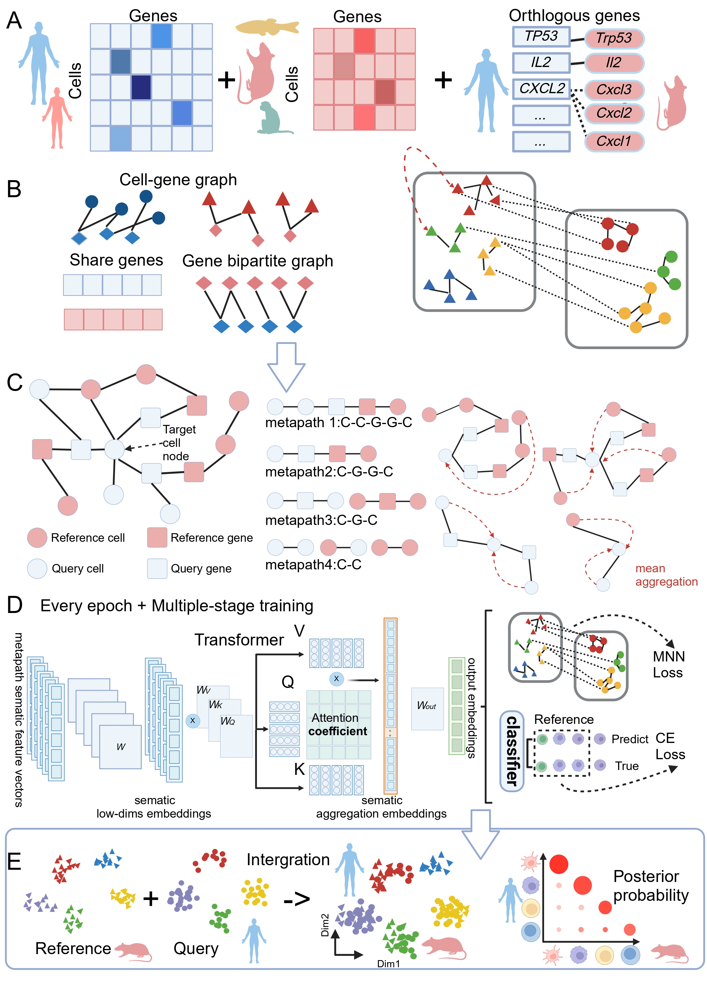

# TACMAN

## Overview



## Create runtime environment

```bash
# create environment
conda create --name TACMAN --file require_TACMAN_conda --yes
conda activate TACMAN
### for interactive mode in Jupytor 
python -m ipykernel install --user --name 'TACMAN' --display-name 'TACMAN' 
```

## Demo scripts

We provide two demo scripts for cross-species integration with TACMAN: `demo_Pancreas` (for human and mouse pancreas) and `demo_LC` (for human and mouse lung cancers).
The data can be accessed from the link below or by unzipping our pre-processed `data.zip`.

+ [pancreas](https://www.ncbi.nlm.nih.gov/geo/query/acc.cgi?acc=GSE84133)
+ [lung cancer](https://www.ncbi.nlm.nih.gov/geo/query/acc.cgi?acc=GSE127465)
