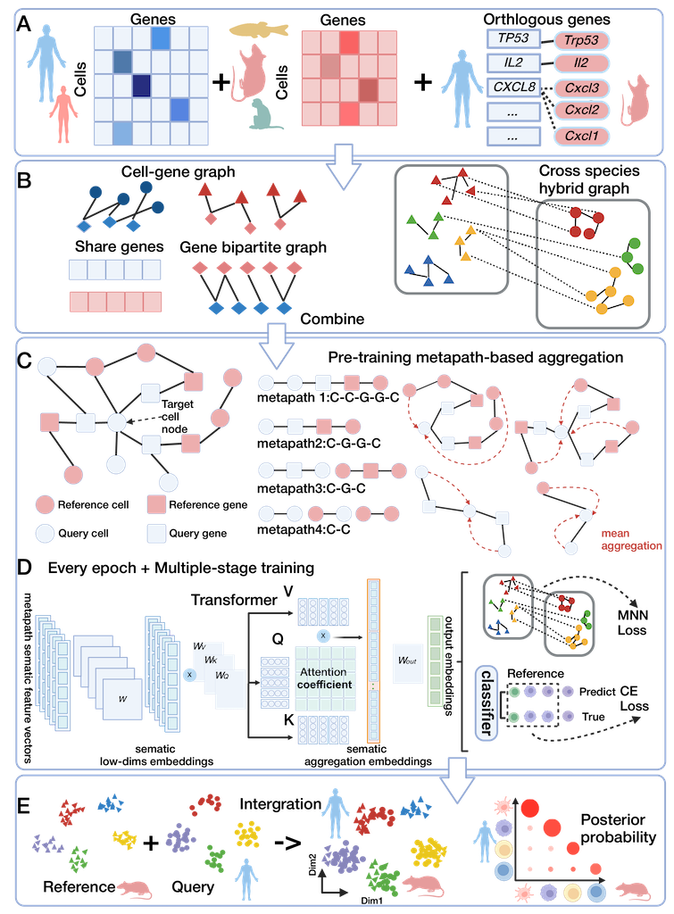

# TACMAN

## Overview



## Create runtime environment

```bash
# create environment
conda create --name TACMAN --file require_TACMAN_conda --yes
conda activate TACMAN
### for interactive mode in Jupytor 
python -m ipykernel install --user --name 'TACMAN' --display-name 'TACMAN' 
```

## Demo scripts

We provide two demo scripts for cross-species integration with TACMAN: `demo_Pancreas` (for human and mouse pancreas) and `demo_LC` (for human and mouse lung cancers).
The data can be accessed from the link below or by unzipping our pre-processed `data.zip`.

+ [pancreas](https://www.ncbi.nlm.nih.gov/geo/query/acc.cgi?acc=GSE84133)
+ [lung cancer](https://www.ncbi.nlm.nih.gov/geo/query/acc.cgi?acc=GSE127465)

## STAR Protocols command-line workflow
This repository provides command-line wrapper scripts and YAML configuration files for running TACMAN in the STAR Protocols workflow. The workflow starts from processed reference and query AnnData objects, prepares or validates cross-species homology mappings, runs TACMAN, and summarizes annotation outputs.

### 1. Create and activate the TACMAN environment

```bash
conda create --name TACMAN --file require_TACMAN_conda --yes
conda activate TACMAN
```

### 2. Check dependencies and wrapper scripts

```bash
python -c "import TACMAN; print('TACMAN OK')"
python -c "import scanpy, anndata, torch, dgl, sklearn, pandas, yaml, matplotlib; print('imports OK')"
blastp -version

python scripts/run_tacman.py --help
python scripts/prepare_homology.py --help
python scripts/summarize_tacman_results.py --help
```

### 3. Validate the human-to-mouse pancreas example

```bash
python scripts/run_tacman.py --config configs/pancreas_tacman.yaml --validate-only
```

### 4. Run TACMAN

```bash
python scripts/run_tacman.py --config configs/pancreas_tacman.yaml
```

### 5. Summarize TACMAN results

```bash
python scripts/summarize_tacman_results.py --config configs/pancreas_results.yaml
```

### 6. Homology preparation

TACMAN can use pre-built homology files, database-derived homology tables, or BLASTP-derived putative homology relationships.

For the built-in human-to-mouse pancreas example, the workflow uses:

```text
homo/human_to_mouse.txt
```

For database-derived or BLASTP-derived homology preparation, see:

```text
README_homology.md
examples/homology/celegans_dmelanogaster/
```

The C. elegans–D. melanogaster example downloads full protein FASTA files from Ensembl release 115 and runs one TACMAN BLAST-mode command to generate a TACMAN-compatible three-column homology file.

### 7. Custom datasets

To run TACMAN on custom datasets, copy and modify the provided YAML configuration files rather than editing the Python scripts directly.

```bash
cp configs/tacman_template.yaml configs/custom_tacman.yaml
cp configs/results_template.yaml configs/custom_results.yaml
```

Users should update the following fields in the copied YAML files:

```text
reference AnnData path
query AnnData path
reference cell-type column
query label column, if available
species names
homology file path
output directory
result summary directory
```

Before running a full TACMAN analysis, validate the input files:

```bash
python scripts/run_tacman.py --config configs/custom_tacman.yaml --validate-only
```
