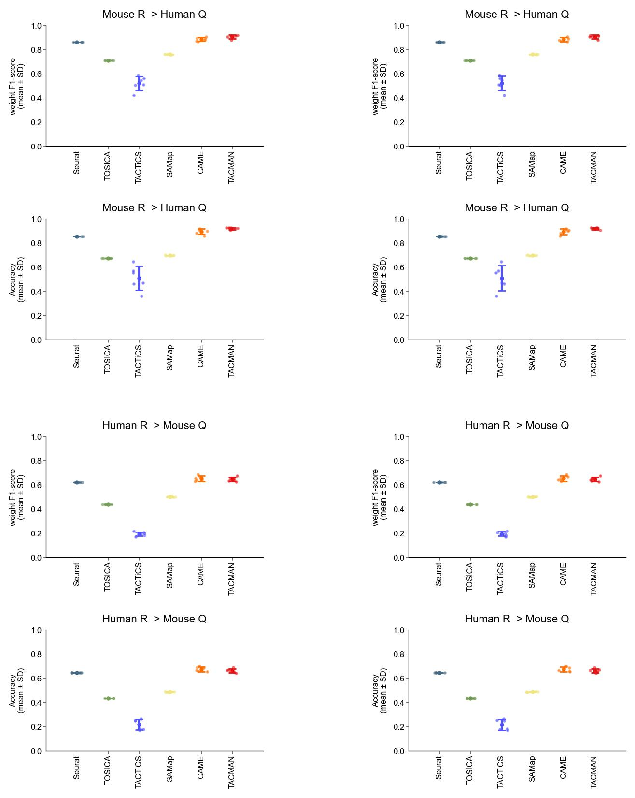

# 01 create a conda environment

The files required to create a conda environment are stored in the directory `benchmark/requires/`

Create the conda environment as needed.


|environment|model|file|
|:-|:-|:-|
|scRNA|seurat|require_scRNA|
|threemodel|SAMap,CAME,TACMAN|require_threemodel|
|TOSICA|TOSICA|`require_TACTiCS.md`|
|TACTiCS|TACTiCS|require_TACTiCS, `require_TOSICA.md`|


# 02 download data and preprocessing

Download and preprocess the spleen data of [Mouse Cell Atlas (MCA)](https://bis.zju.edu.cn/MCA/gallery.html) and [Human Cell Landscape (HCL)](https://bis.zju.edu.cn/HCL/gallery.html).


```shell
cd benchmark
tissue=Spleen

# download HCL data
mkdir -p data/deg/HCL
python script/extract_url.py --info ./data/info_HCL.json --db HCL --tissue ${tissue} --out data/deg/HCL/urls
cd data/deg/HCL && wget -b -c -o download.log -i urls && cd ../../..
# preprocessing
python script/merge_adatas.py --data data/deg/HCL --db HCL --tissue ${tissue} --out data/mtx 

# download MCA data
mkdir -p data/deg/MCA
python script/extract_url.py --info ./data/info_MCA.json --db MCA --tissue ${tissue} --out data/deg/MCA/urls
cd data/deg/MCA && wget -b -c -o download.log -i urls && cd ../../..
# preprocessing
python script/merge_adatas.py --data data/deg/MCA --db MCA --tissue ${tissue} --out data/mtx 

```


# 03 cell_annotation

Cell annotation using Seurat.

see `cell_annotation_HCL.ipynb` and `cell_annotation_MCA.ipynb`

# 04 run

```shell
cd benchmark

# run TACMAN, CAME, SAMap
conda activate threemodel
for i in {1..6}; do
    python script/run_three_model.py --parameter ./parameter_three.yaml --tag batch$i
done

# run seurat
conda activate scRNA
for i in {1..6}; do
    Rscript script/run_seurat.r --parameter ./parameter_seurat.yaml --tag batch$i
done

# run TOSICA
conda activate TOSICA
for i in {1..6}; do
    python script/run_TOSICA.py --parameter ./parameter_TOSICA.yaml --tag batch$i
done


# run TACTiCS
conda activate TACTiCS
for i in {1..6}; do
    python script/run_TACTiCS.py --parameter ./parameter_TACTiCS.yaml --tag batch$i
done
```

# 05 visualization

```shell
conda activate threemodel
python plot.py
```



